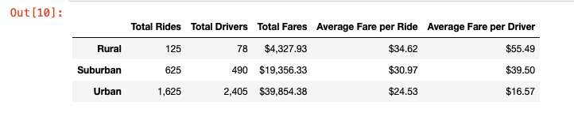
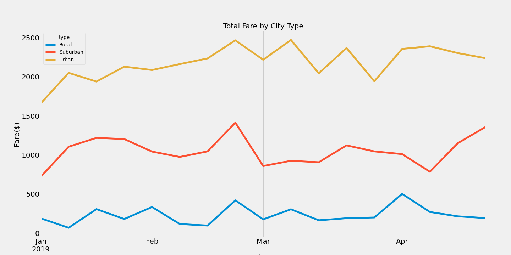

# PyBer_Analysis

## Overview 

Through the use of Pandas Library, the objective of this project is to analyze the ride-sharing data to build a summary Dataframe and, from there, use Matplotlib, Python's plotting library, to explain how the data differs by city-data and how can those findings be used by decision-makers.  

## PyBer Analysis Results 

- From the PyBer Summary Dataframe (Fig. 1), we see that the number of rides in the urban cities is 13 times more than in the rural area and 2.6 times more than in the Suburban area. We can also notice that even when the average fare per ride in the rural cities is about $11 and $5 more per ride than the urban and suburban cities, respectively, the total fares from the urban cities is about 9 times more than the total fares from the rural area and double than the Suburban area. 

- Additionally, we observe that the average fare per driver in the urban cities is about 3- and 2-times lower than the rural and suburban cities, respectively.

*Fig. 1 - PyBer Summary*

- As we see from the Total Fare by City type graph below (Fig. 2), the last week of February is a high peak for the urban, suburban, and rural cities.
- The urban cities have two more high peaks in March, with the lowest peak in mid-January. 
- The suburban cities have the second-best peak in mid-January and the lowest peak in April. 
- The rural cities have the highest peak at the beginning of April, while the lowest peak is at the beginning of January.  

*Fig. 2 - Total Fare by City Type* 

## PyBer Analysis Summary 

Based on the PyBer Analysis, we can see that the more drivers in the area, the more rides can be covered, and therefore, the total fare is higher. Thus, the recommendations would be: 
 
- The company attracts drivers from the urban area to the suburban area, so there are enough drivers to cover the demand in these cities, while there are enough drivers to keep up with the urban demand. 
- The company develops incentives to attract more drivers to the rural cities, especially during the peak seasons, so more rides are covered.
- The company decreases the fare per rive in the rural and suburban cities, especially during the lowest peaks, so the demand for rides increases. 
